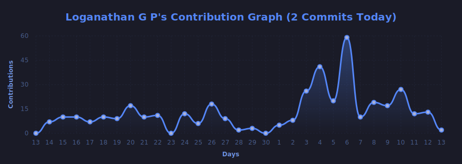

<div align="center">

# 👋 Welcome to Loganathan G P's Profile

[](https://git.io/typing-svg)


</div>

---

## 💼 Professional Summary

**Aspiring Full Stack Developer** with a passion for creating efficient, scalable web applications. Experienced in modern JavaScript frameworks, backend technologies, and cloud services. Currently focusing on React ecosystem and DevOps practices.

```javascript
const loganathan = {
    location: "Chennai, Tamil Nadu, India",
    role: "Full Stack Developer",
    currentFocus: ["React.js", "Next.js", "Jenkins", "System Design"],
    recentProject: "100 Days of React Interview Challenge",
    portfolio: "https://loganathan-portfolio.onrender.com",
    funFact: "Built a fully functional web app in a single weekend! ⚡"
};
```

---

## 🎯 Current Focus

- 🚀 **Working on:** 100 Days of React Interview Challenge
- 📚 **Learning:** React.js, Next.js, Jenkins, Advanced System Design
- 💡 **Project Highlight:** [KEYLESS LOCKER](https://devbridge.onrender.com)
- 🤝 **Open to:** Collaborate on MERN Stack & Python projects
- 💬 **Ask me about:** Frontend Development, Backend APIs, UI/UX Design

---

## 🛠️ Technology Stack

### **Frontend Development**


### **Backend Development**


### **Database & Cloud**


### **DevOps & Tools**


### **Design & Creative**


---

## 📊 GitHub Analytics

<div align="center">

<table>
<tr>
  <td width="50%" align="center">
    
  </td>
  <td width="50%" align="center">
    
  </td>
</tr>
</table>

<div align="center">
  
</div>

<br/><br/>

<div align="center">
  
</div>
</div>

---

## 🏆 Achievements & Recognition

<div align="center"> 
  
</div>

<br/>

<div align="center">
  
  
</div>

---

## 🤝 Connect With Me

<div align="center">

[](https://linkedin.com/in/loganathan26)
[](mailto:LOGUSIVAM26@GMAIL.COM)
[](https://twitter.com/logusivam26)
[](https://www.instagram.com/logusivam_)
[](https://www.facebook.com/profile.php?id=100008730223597)

</div>

---

## 💻 Coding Profiles

<div align="center">

[](https://www.leetcode.com/logusivam)
[](https://www.hackerrank.com/profile/logusivam26)
[](https://www.codechef.com/users/logusivam26)
[](https://devbridge.onrender.com)

</div>

---

## 💭 Developer Quote

<div align="center">


</div>

---

## 📈 Contribution Graph

<div align="center">


<br/><br/>

<table>
<tr>
<td width="50%" align="center">

</td>
<td width="50%" align="center">

</td>
</tr>
</table>

</div>

---

## 🐍 Contribution Snake

<div align="center">


</div>

---

<div align="center">

### 💡 *"Code is like humor. When you have to explain it, it's bad."* – Cory House

### 🌟 Thanks for visiting! Let's build something amazing together! 🚀

[](https://git.io/typing-svg)

</div>
