<div align="center">

# Hi, I'm Loganathan G P 👋

[](https://git.io/typing-svg)

<a href="https://linkedin.com/in/loganathan26"></a>
<a href="mailto:LOGUSIVAM26@GMAIL.COM"></a>
<a href="https://loganathan-portfolio.onrender.com"></a>


</div>

---

## 💼 About Me

**Full Stack Developer** specializing in the **MERN stack** — I build efficient, scalable web applications end to end, from responsive React interfaces to robust Node/Express APIs and cloud deployment. Comfortable across both the JavaScript and Python ecosystems, with a growing focus on **system design**, **CI/CD**, and **DevOps** practices (Docker, Jenkins, Kubernetes).

I care about shipping clean, maintainable code and thoughtful UI — and I learn fast. I'm currently **open to full-time roles and collaboration** on MERN and Python projects.

```javascript
const loganathan = {
    location:          "Chennai, Tamil Nadu, India",
    role:              "Full Stack Developer",
    focus:             ["React.js", "Next.js", "Node.js", "System Design", "CI/CD"],
    currentlyBuilding: "100 Days of React Interview Challenge",
    portfolio:         "https://loganathan-portfolio.onrender.com",
    openTo:            ["Full-time roles", "Freelance", "Open-source collaboration"],
    funFact:           "Shipped a fully functional web app in a single weekend ⚡"
};
```

---

## 🚀 Featured Projects

> _Replace the descriptions below with one crisp sentence each — what it does + the impact/tech highlight. Recruiters scan this section first._

| Project | What it does | Tech | Links |
| :------ | :----------- | :--- | :---- |
| **🔐 KEYLESS LOCKER** | Secure credential / password manager web app _(edit this line)_ | MERN, JWT | [Live](https://devbridge.onrender.com) · `add repo` |
| **🌐 Developer Portfolio** | Personal portfolio showcasing projects & skills | React, CSS | [Live](https://loganathan-portfolio.onrender.com) · `add repo` |
| **📅 100 Days of React** | Daily React + interview-prep challenge log | React, JS | `add repo` |

<!--
TIP: For each project add a public repo link. A live demo with no source code is a weaker
signal to engineers than a clean, well-documented repo. Pin your best 6 repos on your profile.
-->

---

## 🛠️ Tech Stack

### Frontend


### Backend


### Database & Cloud


### DevOps & Tools


### Design


---

## 📊 GitHub Analytics

> These graphics are **generated by a GitHub Action and committed to this repo** as static SVGs — no live third-party rendering, so they never break or rate-limit. (See `.github/workflows/metrics.yml`.)

<div align="center">
  
</div>

---

## 🏆 Achievements & Trophies

<div align="center">
  
</div>

---

## 🤝 Community & Open Source

I don't just push my own code — I help others. I actively participate in **GitHub Discussions and issues across other repositories**, answering questions and contributing solutions.

- 💬 Answered questions and joined discussions in open-source repositories
- 🐛 Reported issues and suggested fixes
- 🔀 Open to contributing PRs to MERN / Python projects

> _Add 2–3 direct links to your best discussion answers or merged PRs here — e.g._
> - `[Answered: <topic>](https://github.com/<owner>/<repo>/discussions/<id>)`
> - `[Merged PR: <title>](https://github.com/<owner>/<repo>/pull/<id>)`

<!--
This is your point #5. A direct link to a thoughtful answer in a popular repo's
Discussions is one of the most underrated recruiter signals — it proves communication
+ technical judgment in public. Worth curating manually.
-->

---

## 🤝 Connect With Me

<div align="center">

[](https://linkedin.com/in/loganathan26)
[](mailto:LOGUSIVAM26@GMAIL.COM)
[](https://twitter.com/logusivam26)
[](https://instagram.com/logusivam26)
[](https://www.youtube.com/@Logusivamacademy26)
[](https://www.facebook.com/profile.php?id=100008730223597)

</div>

<div align="center">

[](https://www.leetcode.com/logusivam)
[](https://www.hackerrank.com/profile/logusivam26)
[](https://www.codechef.com/users/logusivam26)
[](https://loganathan-portfolio.onrender.com)

</div>

---

## 🐍 Contribution Snake

<div align="center">
  
</div>

---

<div align="center">

### 💡 _"Code is like humor. When you have to explain it, it's bad."_ — Cory House

**Thanks for visiting — let's build something great together.** 🚀

[](https://git.io/typing-svg)

</div>
